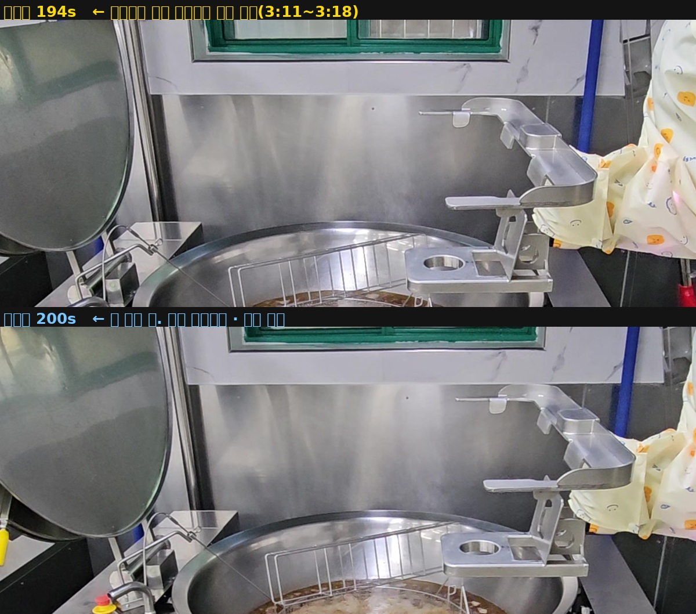

# 조리로봇 연기 조기 경보 — 김과 연기 구별

> **프레임 추출 완료 · 학습 전.** 2026-08-11.
> 발연 출처 **15개**(2,233장 중 학습 후보 350장), 급식실 김 **11곳**(2,044장).
> 착수 시점(2026-08-08)에는 발연 출처가 2개였고 **`실험이 성립하지 않음`** 이었음.
> **아직 학습을 돌리지 않았으며 어떤 성능 수치도 내지 않았음.**
>
> 이 저장소는 [kitchen-fire-poc](https://github.com/K-H-MOON/kitchen-fire-poc) 의
> **6·7회차에서 `미해결` 로 종결한 연기 라인을 다시 여는 것**임.

급식실 튀김솥에서 **불이 붙기 전에 올라오는 흰 유증기**를 잡고, 그것을 **조리 중
발생하는 김**과 구별하는 것이 목적임.

화염은 이미 잡힘 — 앞선 저장소 10회차에서 주방 화재 인식률 49.7%, 사건 단위 8/8,
지연 0초를 확인했음. **화염이 보일 때는 이미 불이 난 것**이며, 그보다 앞선 신호가
필요해서 연기를 봄.

---

## 학습 전에 나온 가장 큰 결과 — 단일 프레임으로는 사람도 못 가름

2026-08-11 에 확인한 것임. **모델을 돌리기 전에 나왔고, 이 실험의 천장을 정함.**

배경 오탐 후보로 뽑아 둔 급식실 튀김 영상(논현중)의 프레임을 훑던 중,
사용자가 원본 영상을 재생해 보고 이렇게 적어 왔음.

> 프레임으로 볼 때에는 김이 발생했는지 아닌지 잘 파악이 안 되는 부분이 있어서
> 원본 영상을 재생해 살펴보니, **영상에서는 김이 관찰되나(짙은 김은 아님)
> 단일 프레임인 사진 파일에선 구분하기 힘들다.**

재생에서 김이 보인 구간(3:11\~3:18)의 194초 프레임을 원본 해상도(1920×1080)로
내려받아 솥 위만 잘라 키우니 흰 것이 보임. **그러나 김이 있다고 짚지 않은 200초를
같은 잘라내기 같은 크기로 나란히 놓으니 구별이 되지 않았음.**

    194초   솥 위에 뿌연 것이 있음      재생에서 김이 확인된 구간
    200초   솥 위에 뿌연 것이 있음      김이라고 짚지 않은 구간
                                    ← 둘을 못 가름

**위가 194초, 아래가 200초임.** 같은 영상 · 같은 잘라내기 · 같은 크기 ·
원본 1920×1080 에서 솥 위 공간만 떼어 1,200px 로 키운 것임.

둘 중 하나임. 200초에도 김이 있거나(재생에서 짚은 목록이 전부가 아니거나),
보이는 것이 김이 아니라 스테인리스 결이거나임.
**한 장으로는 어느 쪽인지 정할 수 없음.** 시트 해상도의 문제가 아니었음 —
원본 해상도로 확대해도 못 가름.

### 앞선 저장소가 **돌리기 전에** 같은 것을 적어 놨음

> **단일 프레임 접근의 한계 가능성도 열어둠.** 김과 연기는 둘 다 회색 반투명
> 부유물이며 **정지 이미지 한 장으로는 사람도 구별이 어려움.** 결정적 단서는
> 시간에 있다 — 끓는 김은 일정하게 유지되나 과열 연기는 점점 짙어지고 어두워짐.

그리고 종결 판정의 근거 셋 중 셋째가 이것이었음.

> 김과 연기는 정지 화면에서 같은 물체(회색 반투명 부유물).
> 구별 단서는 **시간 변화**에 있을 가능성이 높음

**앞선 저장소는 이 벽에 모델 결과로 닿았고, 이번에는 사람 눈으로 닿았음.**
서로 다른 경로로 같은 자리에 왔으므로 이 관찰의 무게가 큼.

### 무엇이 달라지는가

**채점에 천장이 생김.** 이 실험의 모델도 한 장을 봄. **사람이 한 장에서 못 가르는
프레임을 모델이 가르기를 기대할 수 없음.** 판별비가 1을 넘지 못해도 그것이 모델의
실패인지 과제의 천장인지 갈라 말해야 하며, 그 구분을 사전 등록에 적음.

**라벨 절차가 바뀜.** 사람 판정은 반드시 **재생**으로 함. 프레임 시트는 자리를 찾는
도구이지 판정 도구가 아님. `시트로 짚고 원본 한 장을 확대해 확정` 하는 절차를
설계했다가 폐기했음 — 한 장으로 안 보이는 것은 확대해도 안 보임.

**배경 음성 자료가 무너짐.** 아래 「배경 오탐군」 절에 적음.

**값어치도 있음.** 앞선 저장소는 이 한계를 `모델이 못 하니까` 로 적었음.
이번에는 `사람도 못 하니까` 로 적을 수 있고, 대조 그림으로 보일 수 있음.
**더 강한 근거임.**

---

## 왜 종결했던 라인을 다시 여는가

앞선 저장소에 **`연기 조기 경보 — 미해결 · 종결`** 로 기록돼 있음. 6·7회차 두 번의
통제 실험 모두 조리 연기/수증기 판별비가 1 미달이었음(0.54 → 0.75).

다시 여는 이유는 **그 결론이 틀린 평가군 위에서 났을 가능성** 때문임.

| 그룹 | 구성 | 실제로 무엇인가 |
|---|---|---|
| A-smoke | D-Fire 실연기 150장 | **실외 화재의 회색 연기 기둥** |
| E | 스톡 조리 연기 179장 (영상 14개) | 일반 조리 연기. 유류화재 전조가 아님 |

**둘 다 이 저장소의 목표가 아님.** 목표는 실내 튀김솥 위의 흰 유증기임.

같은 일이 화염 쪽에서 이미 일어났었음. 1\~8회차 내내 A(D-Fire)로 화재 인식률을
쟀는데, 8회차에서 새로 잡힌 이미지를 눈으로 열어 보니 **대부분 산불**이었음.
그래서 주방 화재 전용 평가군 F 를 새로 만들었고, 그때부터 숫자가 의미를 갖기
시작했음 — F 인식률 42.3% → 49.7%, 판별비 5.97 → 25.33.

**화염 쪽은 평가군을 바로잡았으나 연기 쪽은 바로잡지 않은 채로 종결했음.**

### 당시 없던 자료가 지금 있음

평가군 F 를 만들면서 수집한 소방 재현 실험 영상의 **점화 직전 구간**에 주방 유류화재
발연 장면이 들어 있음. 착수 시점에는 이것을 kfire02·03 의 **40장**으로 적었음.

**그 40장은 검증된 숫자가 아니었음.** `docs/PREREGISTER_F.md` 의 **화염없음** 열
(9 + 31)을 그대로 옮긴 값이며, 그 프레임에 연기가 보이는지는 확인한 적이 없었음.
실제로 kfire01 의 화염없음 17장을 한 장씩 열어 보니 웍만 놓인 세팅 장면, 소화기
제품컷, 배추 트레이였고 연기는 거의 없었음. **화염없음과 발연은 다름.**

이후 원본 영상을 되찾아 다시 세었고, 새 자료를 더해 지금은 **발연 출처 15개**임.

김 쪽도 마찬가지임. 당시 수증기 평가군 D 는 스톡 영상 24개였고 **급식실이 아니라는
것을 한계로 적어 뒀음.** 지금은 **급식실 11곳**의 국탕·튀김·볶음 조리 영상을 확인했음.

---

## 김과 연기는 무엇이 다른가

### 눈에 보이는 차이는 생각보다 약함

| | 김 | 연기 |
|---|---|---|
| 색 | 백색 (물방울이 모든 파장을 고르게 산란) | **초기엔 청백색\~흰색**, 타면 회색\~검정 |
| 밀도 | 옅고 뒤가 비침 | 짙으면 뒤를 가림. **초기엔 옅음** |
| 경계 | 흐릿함 | 흐릿함 |

**초기 유증기는 흰색에 가까워 김과 구별되지 않음.**

### 시간으로 보면 다름 — 다만 가정에 반례가 하나 나옴

**김은 물방울이라 상승하면서 다시 증발해 사라짐. 연기는 고체 입자라 증발하지 않고
계속 떠다니며 쌓임.**

    김     발생 → 상승 → 소멸        (제자리에서 순환)
    연기   발생 → 상승 → 확산 → 축적  (공간에 축적)

**한 장짜리 사진에는 이 차이가 들어가지 않음.** 어느 순간을 잘라내도 흰 덩어리가 솥
위에 있는 그림이며, 곧 사라질 김인지 계속 쌓일 연기인지 알 방법이 없음.

**그런데 `김은 일정하게 유지된다` 는 가정에 반례가 하나 생겼음.**
로봇고 튀김(배출) 영상을 재생해 보니 우측 솥의 김이 **초 단위로 났다 사라졌다를
반복**했음. 앞선 저장소는 김을 `일정하게 유지` 로 놓고 연기의 `점점 짙어짐` 과
대비시켰는데, 조건에 따라 김도 일정하지 않음(그쪽은 끓는 국탕, 이쪽은 튀김 배출 뒤의
잔열). 한 자료의 관찰이므로 단정하지 않고 **점검 항목**으로 둠.
**다중 프레임 설계로 갈 때 이 기준이 흔들릴 수 있음.**

### 6·7회차에서 수치로 드러난 것

| 무엇을 무엇으로 쟀나 | 결과 |
|---|---|
| 합성으로 학습 → **합성 검증셋** | mAP50 **0.939** (거의 완벽) |
| 합성으로 학습 → **실사 조리 연기** | 인식률 **8.9%** |

두 값은 세는 단위(박스/프레임)와 임계값 처리가 달라 직접 빼면 안 되나,
**방향은 분명함** — 합성 연기의 질감은 외웠으나 실제 장면에서 그 질감이 김과
구별되지 않았음. 지표 차이로 설명될 크기가 아니며 도메인 전이 실패임.

### 발생 조건의 비대칭

**연기는 이상 상태임.** 기름 온도가 임계를 넘거나 음식이 탈 때만 발생함.
화재는 드물게 일어나는데 김은 자주 발생하므로, **김을 연기로 오인하면 경보가
계속 울림.**

> **정정.** 이 저장소에 `김은 급식실에서 상시 발생함` 이라고 적었으나 **틀린 문장이었음.**
> 급식실 28편을 전수로 보니 조리 종류·조리 단계·재료의 수분에 따라 크게 달랐음.
> 볶음만 하는 시간대나 배출 시점에는 김이 거의 없음. 자세한 것은
> [자료원 기록](docs/SOURCES.md) 의 「김의 양을 정하는 세 축」.

---

## 목표를 어디에 둘 것인가 — 흰 연기임

| 온도 | 단계 | 연기 색 |
|---|---|---|
| 200\~230도 | 발연점 | **흰색\~청백색** |
| 300\~330도 | 인화점 | 흰색 (불씨가 닿으면 붙는 상태) |
| 360\~380도 | 발화점 | 저절로 발화 → 이때부터 검은 연기 |

**검은 연기는 이미 늦은 신호임.** 회색이나 검은 연기가 보인다면 기름이 타고 있다는
뜻이고 그 시점에는 화염도 함께 보임. **화염은 10회차 모델이 이미 잡음.**

| 목표 | 구별 난이도 | 얻는 것 |
|---|---|---|
| 검은 연기 | 쉬움 | 거의 없음. 이미 화염 탐지가 덮는 구간 |
| **흰 연기** | **어려움** | **발화 전 수십 초\~수 분** |

정확한 목표를 한 문장으로 두면 — **튀김솥 위에서 발화 직전에 올라오는 흰 연기.**

---

## 시각이 아닌 다른 판단 근거 — 발생 위치. 그러나 약함

**김과 연기가 발생하는 위치가 다름.** 국탕솥은 물이라 김이 정상이고, 튀김솥은
기름만 있으니 흰 것이 이상 신호라는 논리임. 앞선 저장소의
[탐지 JSON 규격 5단계](https://github.com/K-H-MOON/kitchen-fire-poc/blob/main/docs/DETECT_SCHEMA.md)
에 **화구 영역 판정이 이미 만들어져 있음.**

**그러나 급식실 자료를 확인하고 나서 이 근거가 약해졌음.**

| 화구 | 내용물 | 흰 것이 오를 때 |
|---|---|---|
| 국탕솥 | 물 | 김. 위치로 가려짐 |
| **튀김솥** | 기름 + 젖은 재료 | **정상 유증기와 화재 전조가 같은 자리에서 남** |

**남일고 튀김 조리 영상이 그 실물임** — 정상 조리인데 유증기가 화면을 뒤덮고,
목표와 **같은 자리 같은 조리기구**에서 남. 발생 위치는 국탕솥과 튀김솥을 가르는
데까지만 유효하며, **튀김솥 안에서 정상과 이상을 가르는 일은 그대로 남음.**

**화구가 여럿인 프레임을 따로 확보했음.** 숭곡중 튀김은 튀김기 둘의 투입 시점이
다르고, 로봇고 튀김은 `0~13초 우측 솥만` `14~33초 정면만` 으로 시간대가 겹치지 않음.
진선여고는 **목표 화구가 조용하고 뒤쪽에서만 김이 나는** 영상까지 짝으로 있음.
모델이 `화면에 김이 있다` 가 아니라 **어느 화구에서 났는지**를 가리는지 잴 수 있음.

---

## 확보한 자료

### 발연 (양성) — 출처 15개

> **이 표는 2026-08-11 에 통째로 다시 씀.** 처음 표는 출처마다 시간 단위가 달랐음 —
> 전부 재생 초로 적어 놓고 순위를 매겼는데 실제로는 배속·컷·슬로우모션이 섞여 있었고,
> `끊기지 않는 연속 길이가 가장 중요한 값` 이라고 적어 놓고 정작 **토막의 합계**를
> 적었음. 열다섯 개를 원본 해상도로 다시 보고 고친 결과
> **처음 표에서 순위가 맞은 것은 s2 하나뿐이었음.**

`최장 토막` 순임. `뽑음` 은 초당 2장으로 실제 나온 장수, `씀` 은 dHash 로 서로 다른
것만 남기고 상한 32 를 건 값임. 전부 `manifest.json` 에서 읽은 측정값임.

| # | 출처 | 최장 토막 | 토막 | 뽑음 | 씀 | 배경 |
|---|---|---:|---:|---:|---:|---|
| 1 | 天ぷら油火災が発生するまで（訓練） | **171초** | 1 | 341 | 32 | 어두운 그을린 벽 |
| 2 | 火災再現実験動画 ＩＨ 異物挟み込み | 34초 | 1 | 67 | 32 | 어두움 640×480 |
| 3 | 설 명절 식용유 화재 재현 (부산소방) | 16초 | 1 | 31 | 21 | 밝은 목재 |
| 4 | NITE IHこんろ 4.少ない油で発火 | 13초 | 1 | 25 | 25 | **완전히 검음** |
| 5 | Fire Prevention Week (DVIDS) | 13초 | 1 | 25 | 25 | 어두운 상단 |
| 6 | 火災再現実験動画 こんろ 過熱発火 | 11초 | 5 | 39 | 19 | 갈색 벽 · 붉은 조명 |
| 7 | NITE ガスこんろ 3.汚れた鍋 | 11초 | 1 | 21 | 14 | 어두운 회색 |
| 8 | 天草広域連合 シミュレーション | 11초 | 1 | 21 | 19 | 어두운 콘크리트 |
| 9 | Fire Prevention - Cooking Safety | 10초 | 2 | 26 | 24 | **밝은 부엌 + 검은 배경** |
| 10 | 2 東京防災 天ぷら油火災実験 | 9초 | 2 | 24 | 16 | 은박 (밝음) |
| 11 | カンテレNEWS 油少なめ揚げ焼き | 9초 | 3 | 29 | 28 | 검은 조리대 |
| 12 | ファイテック FT-02 消火実験 | 8초 | 2 | 24 | 21 | 회색 콘크리트 |
| 13 | Let’s Chat — Cooking Fire Prevention | 8초 | 1 | 15 | **10** | 밝은 타일 |
| 14 | Fire Safety — Grease Fires in the Kitchen | 8초 | 6 | 42 | 32 | 밝은 콘크리트 야외 |
| 15 | How to Prevent & Douse — Deep-Frying | 6초 | 5 | 35 | 32 | 어두운 업소 주방 |

    뽑음    발연 765장 · 옅음 98장 · 재가열 100장 · 조각 2장 · 섞임 17장   합 982장
    씀      **350장** (초당 2장 · 최대다양 · 출처당 최대 32장)
    배경    어두움 8 · 밝음 4 · 회색특수 2 · 섞임 1

**13번(Let's Chat)이 10장으로 하한과 정확히 같음.** 슬로우모션이라 15장을 뽑아도
서로 다른 것이 10장뿐임. 우리가 정한 출처당 하한이 10장이므로 **한 장이라도 적었으면
이 출처를 빼고 배정을 다시 짜야 했음.** 설계가 막아 준 것이 아니라 운이 좋았던 것이며,
하한에 걸리는 출처가 있을 수 있다는 것을 **추출 전에** 확인했어야 함.

### 김 (음성) — 급식실 11곳

드라이브의 급식실 조리 영상 **28편을 사람이 전수로 보고** 판정함.
처음 이 저장소에는 **4곳**으로 적혀 있었고 시설 이름도 `성곡중` `남일중` `부산체육중`
으로 잘못 적혀 있었음(`숭곡중` `남일고` `부산체고` 가 맞음).

| 급식실 | 조리 | 투입 | 근접 | 원거리 | 뽑음 | 서로 다름 |
|---|---|---:|---:|---:|---:|---:|
| 숭곡중 | 튀김 + 국탕 4편 | 26 | 438 | 121 | 585 | 539 |
| 영동중 | 국탕(투입·교반) | — | 282 | 291 | 573 | 557 |
| 원촌중 | 튀김(full) | — | 201 | — | 201 | 157 |
| 내곡중 | 국탕(재료투입) | — | 198 | — | 198 | 191 |
| 진선여고 | 튀김 쉐이크·배출 | — | 83 | 77 | 160 | 137 |
| 남일고 | 튀김(투입) | 160 | — | — | 160 | 128 |
| 인화여중 | 볶음(재료투입2) | — | 137 | — | 137 | 135 |
| 금정초 | 튀김(투입) | — | 67 | — | 67 | 67 |
| 로봇고 | 튀김(투입) | — | 38 | 27 | 65 | 50 |
| 부산체고 | 튀김(투입) | — | 60 | — | 60 | 57 |
| 울산현대차 | 오토틸팅 | — | 27 | — | 27 | 26 |
| **합** | | **186** | **1,531** | **516** | **2,233** | **2,044** |

**전부 실제 급식실임.** 대형 국솥, 튀김솥, 회전솥, 오토틸팅, 후드, 스테인리스
조리대, 조리사가 그대로 나옴. 배경이 밝은 스테인리스와 흰 타일이라 **흰 김과 대비가
약함** — 이번 실험이 실제로 마주할 조건임.

**태그를 세 갈래로 나눔.** `투입`(재료를 넣은 직후 · 화면을 뒤덮음 · 초당 4장),
`근접`(앞쪽 화구 · 초당 2장), `원거리`(뒤쪽 화구이거나 카메라가 멂 · 초당 2장).
**원거리는 세기가 아니라 크기의 구별임** — 둘을 섞으면 점수를 잘못 읽음. 원거리 김은
모델이 못 보고 지나가 오탐률이 낮게 나올 수 있는데 그건 잘 구별한 것이 아니라
못 본 것임.

→ 구간과 판정 경위: **[김 구간 기록](docs/STEAM_TIMELINE.md)**

### 밝기가 한쪽으로 쏠려 있음

발연 자료는 어두움 8 · 밝음 4 · 특수 2 로 섞여 있는데 **김 자료는 밝은 쪽으로
몰려 있음.** 어두운 급식실로 기록해 둔 울산현대차도 프레임을 실제로 재 보니
평균 휘도 81\~94 로 어둡지 않았고, 화면에서 어두운 것은 급식실이 아니라
**스테인리스 회전솥 안쪽 그늘**이었음.

결과를 볼 때 **밝기 때문인지 김과 연기의 차이 때문인지 갈라낼 수 없음.**
발연의 `밝은 배경 4개` 와 함께 이 실험의 두 맹점임.

---

## 학습·평가 배정 — 프레임을 한 장도 보기 전에 확정함

**층화 없이 시드 고정 단순 무작위. 학습 10 : 평가 5. 분할 다섯.**
`scripts/assign_split.py` 와 `scripts/split_s1.json` 에 있음.

**왜 층화를 안 하는가** — 1회차에서 재려는 값이 **출처가 달라졌으면 결론이 뒤집혔을
것인가** 이기 때문임. 층화는 층 구성이 흔들리는 몫을 배정에서 제거하므로
재려던 것을 못 재게 됨. **분할 간 폭이 재려던 것임.**

| 시드 | 평가 출처 | 평가군(서로 다름) | 학습 소재 |
|---|---|---:|---:|
| 1 | ft · j01 · p2 · q1 · j12 | 95 | 255 |
| 2 | s2 · ft · 05 · kfire02 · 04 | **417** | 242 |
| 3 | j01 · m3 · 07 · kfire03 · q1 | 158 | 217 |
| 4 | ft · m3 · p2 · kt · 05 | 121 | 245 |
| 5 | p2 · 07 · q1 · j04 · 05 | 109 | 250 |

**평가군 크기가 최대 4.4배 벌어짐.** 시드 2 는 s2 하나가 평가군의 82% 를 차지하고,
시드 5 는 옅음 프레임이 0장이라 옅음 성능을 아예 못 잼. 출처 macro 를 쓰기로 한 것이
이 차이를 완화하나, **분할마다 재는 것이 달라진다는 사실 자체는 macro 로 없앨 수 없음.**

**12번(Deep-Frying)은 다섯 분할 어디에서도 평가군에 들어가지 않음.**
학습에만 쓰이고 성능이 한 번도 채점되지 않음. 한 분할에서 평가에 안 걸릴 확률이
2/3 이고 다섯 번 다 안 걸릴 확률이 **13.2%** 이므로 이상한 일이 아님.
배정은 유효하며 사실로 적어 둠.

---

## 채점 기준

### 정탐 판정 단위 — 장 단위. 고른 것이 아니라 자료가 정함

한 장에 임계값 이상인 상자가 하나라도 있으면 정탐으로 셈. **박스와 IoU 는 안 씀.**

박스가 흔들리는 것을 재고 정했음. j01 45.0초(발화 직전 · 가장 뚜렷한 축)에
두 가지 다 말이 되는 읽기로 상자를 그려 봄.

    좁게  확실히 짙은 데까지만    54,600px²
    넓게  옅게 이어지는 위쪽까지  247,500px²   넓이비 4.5배
    IoU = 0.221                            관문 0.5 → 탈락

**같은 프레임 같은 연기인데 두 읽기가 IoU 0.22 임.** 원인은 옅고 짙고가 아니라
**위쪽 경계가 없다는 것** — 연기 기둥이 올라가며 벽 색으로 녹아듦. 아래(냄비 테두리)와
좌우는 정해지는데 위가 안 정해짐. 730\~928장을 그려도 그 상자들이 서로 IoU 0.22 로
갈리면 **재는 것이 연기가 아니라 그리는 사람임.**

**장 단위의 맹점은 그대로 남음** — 어디를 봤는지 모름. 뒤쪽 국솥에 반응해도 정탐이 됨.
모델이 어디에 반응하는지를 봐야 아는 값이므로 **1회차 결과에서 눈으로 확인하는
항목**으로 사전 등록에 적음.

### 지표 — E·D 를 따로 보고하고 판별비를 함께 냄

운용 기준선 한 점에서 **E(조리 연기 인식) · D(김 오탐) · 판별비 E/D** 셋을 다 적고,
임계값을 훑은 곡선은 그림으로 붙임.

**판별비 하나만 보면 안 되는 이유가 앞선 저장소에 실증으로 있음.** 7회차에서 판별비가
0.54 → 0.75 로 올랐으나 원문 그대로 **`올라야 할 E는 11.7%→8.9%로 내려갔`** 음.
분모가 더 빨리 줄어 비율만 오른 것임. 그래서 그 저장소에 **`두 지표를 항상 함께 봄`**
이 못 박혀 있음.

### 분할 합치기 — 다섯 값을 다 적고 폭을 주 결과로 냄

평균·중앙값·최소값을 쓰지 않음. 폭이 애초에 재려던 것이기 때문임.

---

## 평가군의 배경 지름길과 배경 오탐군

### 배경 지름길

    평가 양성 (연기)   전부 소방 시연장 · 실험실 · 야외
    평가 음성 (김)     전부 급식실

이대로 채점하면 **모델이 `여기가 급식실인가 아닌가` 만 봐도 만점이 나옴.**
연기를 배운 것이 아니라 배경을 외운 것인데 점수로는 구분되지 않음.

**막을 방법은 이미 모은 자료 안에 있음.** 소방 재현 영상에는 물을 붓거나 젖은 재료를
넣은 뒤 오르는 **수증기**가 들어 있음. 수집 과정에서 `화재 뒤의 흰 것은 물부터
의심하라` 며 양성에서 걸러 냈던 것들인데, 버릴 것이 아니라 **음성으로 쓸 것**이었음.
같은 배경에서 김과 연기가 둘 다 나오므로 배경으로는 가릴 수 없게 됨.

완전히 없애지는 못함. 양성 쪽에 급식실이 하나도 없다는 비대칭은 남으며 한계로 유지함.

### 배경 오탐군이 무너짐 (2026-08-11)

`김도 연기도 없는 정상 급식실 조리` 프레임을 따로 두어 **배치 환경에서 헛울리지
않는가** 를 재려 했음. 앞선 저장소의 평가군 B(개원중 CCTV 75장)와 같은 역할임.

후보 1,126장을 뽑아 놓고 확인하다 위의 **단일 프레임 한계**에 부딪혔음.
**한 장으로는 `김이 없다` 를 확정할 수 없음.** 그래서 재생으로 확인했고,
**옅은 김의 기준은 만들지 않기로 함** — 김이 초 단위로 났다 사라졌다 하므로
초당 1장으로 뽑은 그 한 장이 김이 있는 순간인지 없는 순간인지가 **우연**이기 때문임.

**영상 단위로만 가름.** 한 번이라도 김이 확인되면 그 영상은 배경 오탐군에 안 씀.

| 출처 | 뽑음 | 서로 다름 | 판정 |
|---|---:|---:|---|
| 개원중 CCTV 투입 | 289 | 87 | 남음 |
| 개원중 CCTV 배출 | 241 | 91 | 남음 |
| 로봇고 튀김(쉐이크) | 44 | 29 | 남음 |
| 논현중 튀김(full) | 435 | 409 | **뺌** — 재생에서 김 확인 |
| 로봇고 튀김(배출) | 46 | 33 | **뺌** — 우측 솥에 깜빡이는 김 |
| 숭곡중 볶음(재료투입2) | 71 | 68 | **뺌** — 교반기에서 김 |

**서로 다름 717장에서 207장으로, 71% 를 잃었음. 그리고 남은 것의 86% 가
개원중 CCTV 임.**

### 개원중 CCTV — 이 프로젝트의 선결 조건을 보여 주는 자료

튀김솥에 재료를 투입했는데도 김으로 볼 만한 것이 화면에 전혀 없음. 기름이 부글거리는
것은 보이는데 김만 안 보이고 프레임이 뚝뚝 끊어짐. **뽑은 530장 중 서로 다른 것이
178장뿐(66% 감소)** 이며, 다른 급식실은 0\~23% 임. **같은 그림이 반복된다는 뜻임.**

CCTV 는 낮은 비트레이트로 압축되는데 **압축에서 가장 먼저 사라지는 것이 옅고
경계가 흐린 것**임. 흰 김이 정확히 그러함. **그렇다면 연기도 안 보일 가능성이 큼.**

**같은 영상에서 사람은 보였음** — 사람 인식 저장소가 이 CCTV 로 240프레임 중 65장에
사람 라벨을 붙였고 잘 보였음. **작업 범위 사람 인식은 CCTV 로 되지만 연기 조기 경보는
안 될 수 있다는 뜻임.**

**회의 때 물어볼 것 — 로봇에 달릴 카메라가 급식실 천장 CCTV 인지 별도 카메라인지.**
기존 CCTV 라면 이번 실험이 성공해도 현장에서 안 될 수 있고, 그렇다면
**카메라 사양이 이 프로젝트의 선결 조건**이 됨.

---

## 이번에 다르게 할 것

### 평가군을 목표 도메인으로 바꿈

**공개 데이터셋으로 검증하지 않음.** D-Fire 의 smoke 는 실외 화재의 회색 기둥이고
이 저장소의 목표는 실내 튀김솥 위 흰 유증기임. 같은 `연기` 라는 이름을 쓸 뿐 다른
물체임. 공개 데이터셋은 **판정 기준이 아니라 참고 지표**로만 씀.

### 합성은 그대로 실행함

급식실에 실제로 불을 낼 수 없듯 **급식실 튀김솥에서 유증기를 낼 수도 없음.**
소방 재현 영상은 급식실이 아니라 실험장이나 야외임. 그대로 학습시키면 모델이
**`그 실험장 배경이면 연기`** 를 외울 수 있음.

    화재    실주방 프레임 + 실화염 소재   → 합성 → 자동 라벨
    연기    실주방 프레임 + 실유증기 소재 → 합성 → 자동 라벨

**합성 배경은 급식실을 쓰되 시설을 완전히 분리함** — 합성에 쓴 급식실이 평가에도
나오면 배경을 외운 것을 성능으로 읽게 됨.

### 연기는 화염보다 어려움

**알파 추출이 까다로움.** 화염은 밝기를 기준으로 배경을 지워 오려낼 수 있었음
(휘도 키잉). 연기는 배경보다 특별히 밝지 않고 반투명해서 이 방법이 통하지 않음.
**흰 연기를 밝은 배경에서 오려내면 밝기 차이가 거의 없어 경계가 뭉개짐.**
神戸市消防局 영상이 그 실물 예시임 — 360p 라서 안 보이는 줄 알고 720p 를 다시 받았는데
**진짜 문제는 배경이 은박이라 사람 눈으로도 경계가 안 보이는 것**이었음.

### 실사를 소수 섞으려던 계획 — 철회함

앞선 저장소는 **수작업 바운딩박스 0건**이 원칙이었고, 이번에는 실사 발연 프레임에
손으로 박스를 그려 소수 섞는 것을 검토했음. `연기 박스는 큰 덩어리 하나라 몇 초면
그림` 이라고 적어 뒀음.

**철회함.** 위 「채점 기준」의 IoU 0.221 이 근거임 — 같은 프레임을 두 가지로 읽으면
박스가 그만큼 갈림. **박스를 학습에 넣으면 그 흔들림을 그대로 가르치게 됨.**

---

## 진행 상황

**완료**

- ✅ 문제 정의 · 6·7회차 재검토 · 목표 확정(발화 직전의 흰 연기)
- ✅ **기존 자료 재검증** — `발연 40장` 이 화염없음 열을 옮긴 값이었음을 확인하고 정정
- ✅ **발연 영상 수집 — 출처 15개** (착수 시점 2개)
- ✅ **급식실 김 자료 확인 — 11곳** (처음 기록은 4곳)
- ✅ **발연 구간 전수 확정** — 15편을 원본 해상도·0.2초 단위로 → `docs/TIMELINE.md`
- ✅ **학습·평가 배정 확정** — 프레임을 한 장도 보기 전에
- ✅ **프레임 추출** — 발연 982장(학습 후보 350장) · 김 2,233장 · 배경 후보 1,126장
- ✅ **채점 기준 C·E·F 확정** — 장 단위 · E·D 따로 + 판별비 · 폭을 주 결과로
- ✅ **단일 프레임 한계 확인** — 사람도 한 장으로는 못 가름

**진행 중**

- ⬜ 배경 오탐군 재구성 ← 207장 중 86% 가 개원중 CCTV
- ⬜ 채점 기준 D(임계값) · G(성립선) — 배경군이 정해져야 숫자로 적을 수 있음
- ⬜ 사전 등록 `docs/PREREGISTER_S1.md`

**미착수**

- ⬜ 김 세기 분류 (짙음/옅음)
- ⬜ 연기 알파 추출 — 밝은 배경 위 흰 연기. **가장 큰 난관**
- ⬜ 합성 학습셋 생성 및 1회차
- ⬜ **1회차 학습 시간 실측** ← 이 값을 알아야 다섯 분할을 다 돌릴지 정할 수 있음
- ⬜ 화구 영역 판정과의 결합

---

## 원칙

앞선 두 저장소의 원칙에 이번에 겪은 것을 더함.

**판정 기준을 결과보다 먼저 확정** — 통과선·해석 규칙·예상되는 한계를 사전 등록에 적고
채점 후 수정하지 않음.

**목표 도메인으로 평가** — 공개 데이터셋 수치를 판정 기준으로 쓰지 않음.

**학습·평가는 출처 단위 분리** — 같은 영상에서 소재를 오려 학습하고 같은 영상으로
채점하면 아무것도 증명되지 않음.

**한 회차에 한 변수만 변경.**

**불리한 수치도 함께 공개** — 실패한 회차와 틀린 진단을 지우지 않음.

**숫자만 보고 판단하지 않음** — 앞선 두 저장소에서 판정이 뒤집힌 경우가 모두 이미지를
열어봤을 때였음.

**한계를 적어 두는 것과 그 기록을 다음 작업에서 쓰는 것은 다름** — 자료 선별을
자동화하려고 주황 화소 비율로 화염을 걸렀다가 kfire03 의 발연 13초를 통째로 놓쳤음.
**같은 실패가 `docs/PREREGISTER_F.md` 에 빨간 소방차까지 그대로 적혀 있었고 그 문서를
며칠 전에 읽고 인용까지 한 뒤였음.** 기록은 읽는 것이 아니라 작업 절차에 넣어야 함.

### 이번에 새로 세운 것

**잴 수 있는 것은 잰다. 재지 않고 눈대중하지 않는다.**
이 저장소는 숫자가 결론을 만드는 기록임. 잘못 센 숫자 하나가 그대로 판단으로 굳음 —
실제로 `뽑힘 364장` 이 표에 측정값처럼 적혀 있었고(구간 길이에서 암산한 예상값이었음),
그것을 믿고 추출이 틀렸다고 진단해 재실행까지 요청했음. **실제 값은 350장이었고
추출은 처음부터 맞았음.** 눈대중 한 번이 잘못된 진단을 낳고 잘못된 진단이 사람의
시간을 씀.

**사람이 재생해서 판정하고 기계는 뽑기만 함.**
프레임만으로는 알 수 없는 것이 셋 있음 — **소리, 시간의 흐름, 조리의 맥락**임.
재료를 넣은 것인지 뺀 것인지, 물을 부은 것인지 뚜껑을 덮은 것인지는 재생해야 앎.
**단일 프레임 한계가 확인된 뒤로는 이것이 선택이 아니라 필수가 됨.**

**추천은 추천으로 적고 동의를 받기 전에는 확정으로 기록하지 않음.**
실제로 배경 오탐용 자료 하나를 추천했다가 질문 하나로 철회한 일이 있었음 —
추천으로만 적어 두었기에 되돌리는 데 비용이 들지 않았음.

**원인을 말할 때도 잰다. 패턴이 맞아떨어지는 것은 근거가 아님.**
김 추출에서 8개 구간의 끝 프레임이 안 나왔고 `구간 끝 == 영상 길이` 인 자리에서만
그런 것이 8건, 그 밖에서 0건이었음. 패턴이 깨끗했으나 거기서 멈추고 영상 길이를
실측했더니 **다섯만 그 이유였고 셋은 영상이 충분한데도 안 나왔음.**
패턴만 믿었으면 틀린 원인을 기록으로 굳혔을 것임.

---

## 한계

### 착수 시점에 이미 알던 것

**초기 유증기가 김과 색으로 구별되지 않음** — 문제의 본질이며, 조기 경보를 목표로 하는
한 피할 수 없음.

**소방 재현 영상은 급식실이 아님** — 실험장·야외이며 조명과 배경이 다름.

**급식실 김 자료는 있으나 급식실 연기 자료는 없음** — 평가군의 positive 와 negative 가
서로 다른 촬영 조건에서 옴. 급식실에서 불을 내는 실험 영상은 존재하지 않으므로
**자료를 더 모아도 풀리지 않음.** 결과는 `급식실에서 이만큼` 이 아니라
**`주방 유류화재 발연에서 이만큼`** 까지만 말할 수 있음.

### 자료를 모으면서 알게 된 것

**발연점과 눈에 보이는 발연이 다름** — 발연점은 200\~230도인데 계측 영상에서 카메라에
연기가 잡히기 시작하는 것은 **330도 부근**임. **이 실험이 잡을 수 있는 것은 발연점
직후가 아니라 한참 뒤이고 예고 시간도 그만큼 짧아짐.**

**기름이 적으면 예고 시간이 더 짧아짐** — 500mL 는 12분 만에 발화했고 100mL 는 그보다
짧았음. 그런데 기름이 적으면 연기의 양도 적음. **적은 기름과 밝은 배경이 겹치면 빨리
붙는데 보이지 않음.**

**튀김솥 위에서는 발생 위치가 판단 근거가 되지 못함** — 정상 튀김 조리 중에도
유증기가 화면을 뒤덮음.

**평가군에 배경 지름길이 있음** — 양성은 시연장, 음성은 급식실이라 배경만 봐도 점수가
나옴. 시연장 수증기를 음성에 섞어 완화하나 없애지는 못함.

**김 자료의 밝기가 한쪽으로 쏠려 있음** — 어두운 급식실이 사실상 없음.
결과가 밝기 때문인지 김과 연기의 차이 때문인지 갈라낼 수 없음.

**되찾지 못한 자료가 있음** — 앞선 저장소에 kfire05·06·07 의 출처가 설명만 있고 링크가
없어 원본을 회수하지 못했음. **앞으로 받는 자료는 원본 링크를 함께 기록함.**

### 프레임을 뽑고 나서 알게 된 것 (2026-08-11 추가)

**단일 프레임으로는 사람도 김을 가리지 못함** — 이 문서
[맨 앞](#학습-전에-나온-가장-큰-결과--단일-프레임으로는-사람도-못-가름)에 적은 것이며
**가장 큰 한계임.** 채점의 천장이 여기서 정해짐.
증거 그림 → [`docs/single_frame_limit.jpg`](docs/single_frame_limit.jpg)

**출처 하나가 하한과 정확히 같음** — `Let's Chat` 이 서로 다른 프레임 10장이고
하한이 10장임. 한 장이라도 적었으면 배정을 다시 짜야 했음.

**분할마다 평가군 크기가 4.4배 다름** — 시드 2 는 s2 하나가 82% 를 차지하고
시드 5 는 옅음 프레임이 0장임. 출처 macro 로 완화하나 없애지는 못함.

**12번은 성능이 한 번도 채점되지 않음** — 다섯 분할 어디에서도 평가군에 안 들어감.

**배경 오탐군이 사실상 개원중 CCTV 하나임** — 그런데 개원중은 김도 연기도 안 담기는
카메라임. 거기서 오탐이 안 나는 것은 배치 환경의 증거가 못 됨.

**연기 박스를 그릴 수 없음** — 같은 프레임을 두 가지로 읽으면 IoU 0.221 로 갈림.
위쪽 경계가 없기 때문임. 실사 박스를 학습에 섞으려던 계획을 철회함.

**자동 판정이 반복해서 실패했음** — 주황 화소 게이트, 화염 절대 임계값(세 번),
워터마크 자동 측정(네 번 연속), 연기 기둥 밝기차. 마지막 것은 기준으로 삼은 벽이
그늘져 있어 **연기가 아니라 조명을 재고 있었음.**
**숫자가 나왔다고 잰 것이 아님.** → [자료원 기록](docs/SOURCES.md) 의 「자동 판정의 실패」

---

## 상세 문서

→ **[자료원 기록](docs/SOURCES.md)** — 발연 15개·김 11곳을 왜 채택하고 왜 뺐는지,
수집 경위와 검색어, 자동 판정이 실패한 여덟 건, 틀린 판정과 정정, 계측 근거

→ **[발연 구간 확정 기록](docs/TIMELINE.md)** — 열다섯 개의 발연·발화 구간을
원본 해상도로 초 단위까지 판정한 전수 기록. **프레임 추출이 이 문서에 의존함.**

→ **[김 구간 기록](docs/STEAM_TIMELINE.md)** — 급식실 11곳의 김 구간, 태그와 밀도,
영상 길이 실측, 추출 결과. 아직 확정이 아닌 줄은 `[애매함]` 으로 표시해 둠

---

## 관련 저장소

[kitchen-fire-poc](https://github.com/K-H-MOON/kitchen-fire-poc) — 화염 인식 (종결된 기록).
합성 학습 파이프라인, 평가 설계, 탐지 JSON 규격, 웹3D 전이 측정.
**이 저장소가 이어받는 6·7회차 연기 실험의 원 기록.**

[kitchen-person-poc](https://github.com/K-H-MOON/kitchen-person-poc) — 작업 범위 사람 인식 (진행 중).
